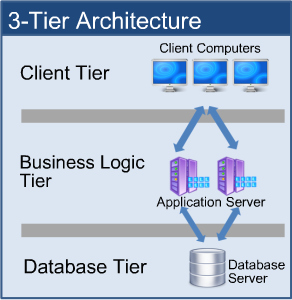

1. An introduction
==================

- Prologue
- Architectures
- SOA
- Microservice Architecture
- Dropwizard, Spring Boot
- Polyglot persistence and languages
- Platforms as a Service
- Software as a Service

## Prologue

> Divide et impera

A spectre is haunting present architecture design.

But, differently from the spectre of early 20th century, no one is entered in a holy alliance to exorcise it.
No pope, no tzar, no Metternich and Guizot.

On the contrary the software development community is more and more embracing the new concept of microservices.

And why this should not occur? Microservices seems to offer at the moment undeniably advantages in terms of software architecture and in software development.

Scope of this book is to give an insigth into this new approach and to provide a working example of microservices in the real world.

## Architectures

Traditionally, architecture are build in a three tiers fashion: a client side, a database and a server side.

Client side applications usually consist of a set of HTML pages and javascript libraries, handled by a browser and defining the user interface, what the actual user sees and uses.

Databases, on the other hand, provided the basic data to populate and control the HTML layer; usually traditional databases, mostly relational, consist of variuos tables managed by a common database management system.

In the middle of the previuos two tiers, lay the server application, responsible to handle any request from the client side, run any business logic to retrieve, update and combine the data coming from the database into a HTML views.

We will focus out attention on this last component.

Usually this component is a large _monolithical_ beast, self contained, where all our logic processes occurs and are executed.

## SOA
## Microservice Architecture
## Dropwizard, Spring Boot
## Polyglot persistence and languages
## Platforms as a Service
## Software as a Service

